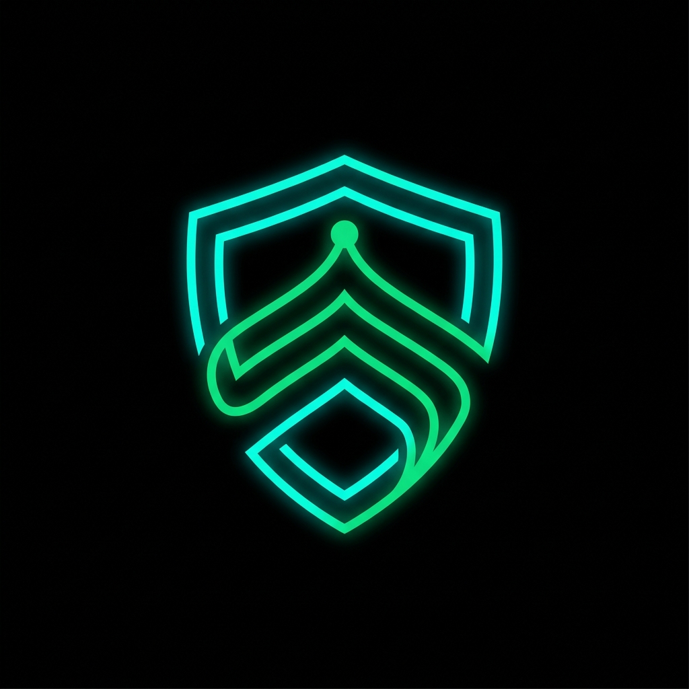
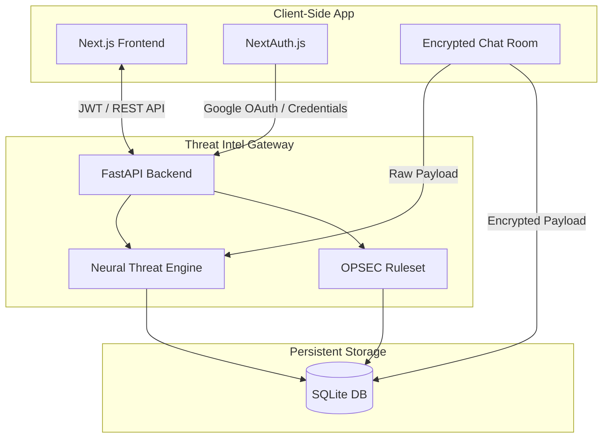

<div align="center">
  
  <h1>🛡️ SentinelNet</h1>
  <p><strong>AI-Defended Secure Communication & Zero-Trust Threat Intelligence Platform</strong></p>

  <p>
    <a href="https://nextjs.org/"></a>
    <a href="https://fastapi.tiangolo.com/"></a>
    <a href="https://tailwindcss.com/"></a>
    <a href="https://www.sqlite.org/index.html"></a>
  </p>
</div>

<br/>

## 🌐 Overview
**SentinelNet** is a defense-grade, zero-trust communication platform engineered to detect, intercept, and mitigate modern social engineering vectors. By integrating real-time **AI heuristic scanning**, **OPSEC validation**, and **End-to-End Encryption (E2EE)**, SentinelNet ensures that compromised operational data and AI-generated deepfake text never reach their targets.

Built for  hackathon, this ecosystem provides both a highly secure field-agent chat interface and a global Command HQ dashboard for real-time telemetry.

---

## ✨ Core Capabilities

### 🔐 Zero-Trust Messaging
- **E2EE Infrastructure**: Payloads are secured using simulated AES-256 + RSA-2048 encryption with forward secrecy per session.
- **Ephemeral Storage**: All messages utilize a highly secure local SQLite instance to prevent data leakage and memory retention.
- **Biometric & Node Auth**: Simulated multi-node verification before message decryption.

### 🧠 Neural Threat Engine
- **AI-Content Detection**: Uses advanced NLP heuristics (Type-Token Ratio, Burstiness, Sentence Variance) to identify LLM-generated deepfake text.
- **OPSEC Guardian**: Intercepts precise geo-spatial coordinates, military timeframes, and classified keywords to prevent accidental or malicious data leaks.
- **Phishing Interceptor**: Automatically quarantines malicious routing links, urgency-driven social engineering prompts, and PII requests.

### 📊 HQ Command Dashboard
- **Live Global Telemetry**: Real-time charts and metric visualizations monitoring network health, intercepted threats, and active nodes.
- **Role-Based Access Control (RBAC)**: Strict separation of privileges between Users, Field Agents, Analysts, and Commanders.

---

## 🏗️ System Architecture



---

## 🚀 Getting Started

### Prerequisites
- **Node.js** (v18+)
- **Python** (v3.9+)
- **Git**

### Quick Start (Windows)
We've included a unified batch script to launch both the FastAPI backend and Next.js frontend simultaneously:
```bash
./run_dev.bat
```

### Manual Installation

**1. Launch the Threat Intel Backend**
```bash
cd backend
python -m venv venv
# On Windows: venv\Scripts\activate | On Mac/Linux: source venv/bin/activate
pip install -r requirements.txt
python -m uvicorn app.main:app --reload --host 127.0.0.1 --port 8000
```
*API Documentation available at: `http://localhost:8000/docs`*

**2. Launch the Client Frontend**
```bash
cd frontend
npm install
npm run dev
```
*Platform available at: `http://localhost:3000`*

---

## 🎨 UI/UX Design Aesthetics
- **Dark Mode Native**: Slate-950 and True Black backgrounds tailored for low-light tactical environments.
- **Neon Accents**: High-contrast Teal, Emerald, and Rose indicators for immediate threat-level recognition.
- **Micro-Interactions**: Framer Motion powers smooth layout transitions, scanning pulse animations, and threat-escalation alerts.

---

<div align="center">
  <p><i>Built for the Next Generation of Secure Communications</i></p>
  <p>&copy; 2026 SentinelNet Core Systems. All Rights Reserved.</p>
</div>
